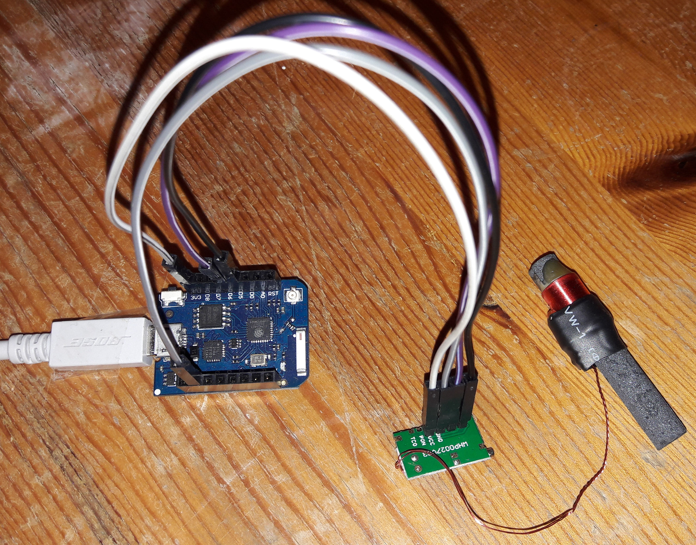

# set-rtc-using-dcf77-via-dcf1

MicroPython module and script that set the real time clock (RTC) of an ESP8266
from the DCF77 time signal, received with a Pollin DCF1 module.

* DCF77 signal: https://en.wikipedia.org/wiki/DCF77
* DCF1 receiver module: https://www.pollin.de/p/dcf-77-empfangsmodul-dcf1-810054

## Hardware and wiring

Tested with a Wemos D1 mini pro (ESP8266) running MicroPython 1.22.2.

| DCF1 pin | ESP8266 | D1 mini label | Purpose                          |
| -------- | ------- | ------------- | -------------------------------- |
| VCC      | 3V3     | 3V3           | supply                           |
| GND      | GND     | G             | ground                           |
| PON      | GPIO14  | D5            | enable, **active low**           |
| DATA     | GPIO12  | D6            | demodulated DCF77 signal          |

The pin numbers live at the top of [main.py](main.py) — change them there if you
wire it differently.

PON is **active low**: the DCF1 only runs while that pin is held at 0. Creating
the pin with `Pin(14, Pin.OUT)` and no explicit value leaves it high on the
ESP8266, and then the data line stays flat at 0 and nothing is ever decoded —
which looks exactly like a reception problem. `main.py` therefore uses
`Pin(PON_PIN, Pin.OUT, value=0)`. Measured on the hardware: with PON high the
data pin showed zero edges in 3 s, with PON low it showed one pulse per second.

Reception is the hard part, not the software: keep the ferrite antenna away from
the ESP8266, from switching power supplies and from displays, and align it
broadside to Frankfurt. The onboard LED of the DCF1 should blink once per second.



## Installation

Find the port your board sits on first — `python -m mpremote devs` lists them,
and the board is the one with a USB-serial vendor id such as `1a86:7523`
(CH340) or `10c4:ea60` (CP2102). Do not guess: on many business laptops `COM3`
is the built-in Intel AMT serial-over-LAN port, which happily accepts a
connection and then stays silent forever.

Copy both files to the board, e.g. with [ampy](https://github.com/scientifichackers/ampy):

```
ampy --port COM14 put dcf2rtc.py
ampy --port COM14 put main.py
```

or with [mpremote](https://docs.micropython.org/en/latest/reference/mpremote.html),
the official tool (`pip install mpremote`), which does transfer and terminal
in one:

```
mpremote connect COM14 fs cp dcf2rtc.py :
mpremote connect COM14 fs cp main.py :
```

`main.py` runs automatically on boot. It retries until one telegram decodes
cleanly, which takes at least one minute and, with a weak signal, considerably
longer.

## Connecting to the REPL

To watch the decoder work, attach a serial terminal to the board. On Linux and
macOS, [picocom](https://github.com/npat-efault/picocom):

```
picocom /dev/ttyUSB0 -b 115200        # leave with Ctrl-A Ctrl-X
```

On Windows use `mpremote connect COM14 repl` (leave with Ctrl-]), PuTTY or
Tera Term — picocom is not available there.

Three things that bite:

* **The port can only be open once.** Close the terminal before running `ampy`
  or `mpremote fs cp`, otherwise the transfer fails.
* **`main.py` has already started** by the time you connect, so the REPL is busy
  inside the retry loop and shows no prompt. Press `Ctrl-C` to interrupt it and
  get back to `>>>`. From there you can rerun it by hand:

  ```python
  >>> import main            # the whole thing
  ```

  A second `import main` does nothing, because MicroPython caches modules —
  use `Ctrl-D` for a soft reset, which restarts `main.py` from scratch.
* **Per-bit output is off by default.** Set `DEBUG = True` in `dcf2rtc.py` to
  see the received bits scroll by, which is the quickest way to tell a reception
  problem from a decoding problem. Without it you only get the stage messages,
  the decoded time and any errors.

## How it works

DCF77 transmits one bit per second by shortening the carrier: a 100 ms drop
means 0, a 200 ms drop means 1. Second 59 carries no pulse at all, which marks
the end of a telegram.

1. `detectNewMinute()` samples the pin every 100 ms and waits for 1.5 s of
   silence — that is the missing pulse of second 59.
2. `computeTime()` samples every 50 ms and slides a 7-sample window over the
   signal to classify each pulse as 0 or 1, until 59 bits are collected.
3. The telegram is checked (see below) and, if it survives, written to the RTC
   **when the next minute mark arrives**, with seconds set to 0.

Step 3 matters: the bits sent during one minute describe the *following* minute.
Decoding them and subtracting a minute afterwards is what the earlier version of
this code did, and it produced `minute = -1` whenever the telegram decoded to a
full hour.

Both functions give up after a timeout and return `False`, so a disconnected or
badly received module makes the script retry instead of hanging forever.

Set `DEBUG = True` in [dcf2rtc.py](dcf2rtc.py) to print every received bit. Keep
it off otherwise — printing over the serial line is slow enough to disturb the
50 ms sampling.

## What a telegram has to survive

Parity only catches an odd number of bit errors, so a corrupted telegram can
pass it and still carry nonsense. Everything that can be checked cheaply is
therefore checked, and a telegram that fails any of it is discarded with a
message naming the reason:

* bit 0 is 0 and bit 20 is 1
* the three even parity groups (minute, hour, date)
* the timezone bits 17/18 are either `10` (CEST) or `01` (CET), never both or
  neither
* every BCD field has valid digits — no `1111` sitting in a decimal place
* minute 0..59, hour 0..23, day 1..31, weekday 1..7, month 1..12
* the day exists in that month, leap years included, so no 31 September and no
  29 February in 2026
* the transmitted weekday matches the transmitted date

## Local time or UTC

DCF77 carries German local time, and that is what lands in the RTC by default.
Set `USE_UTC = True` in [main.py](main.py) to store UTC instead. The offset is
taken from the timezone bits of the telegram itself rather than from a rule, so
it is right on both sides of a daylight saving change — and a clock in UTC does
not jump twice a year, which makes logged timestamps comparable.

The announcement bits are evaluated too: an upcoming daylight saving change
(bit 16) or leap second (bit 19) is printed as a note.

## Tests

    python tests/test_dcf2rtc.py

[tests/test_dcf2rtc.py](tests/test_dcf2rtc.py) replaces the receiver with a
virtual clock and a fake pin that rebuilds the modulated carrier from it, so a
whole minute of radio traffic is decoded in milliseconds and cases that are
awkward to wait for — midnight, new year, 29 February, a corrupted telegram —
are just another entry in a table. Plain CPython, no dependencies, no board.

## Known limitations

* A leap second is announced but not acted upon — the minute in which it
  happens is simply decoded as usual.
* `RTC.datetime()` expects 0 = Monday while DCF77 counts 1 = Monday; the module
  converts, but some MicroPython ports ignore the weekday field on write anyway.
* The module needs `utime.mktime()` and `utime.localtime()`, which the ESP8266
  port provides. A port without them cannot do the UTC conversion or the
  weekday cross check.

## License

Public domain, see [LICENSE](LICENSE) — the Unlicense. Do whatever you like
with it; no attribution required.
